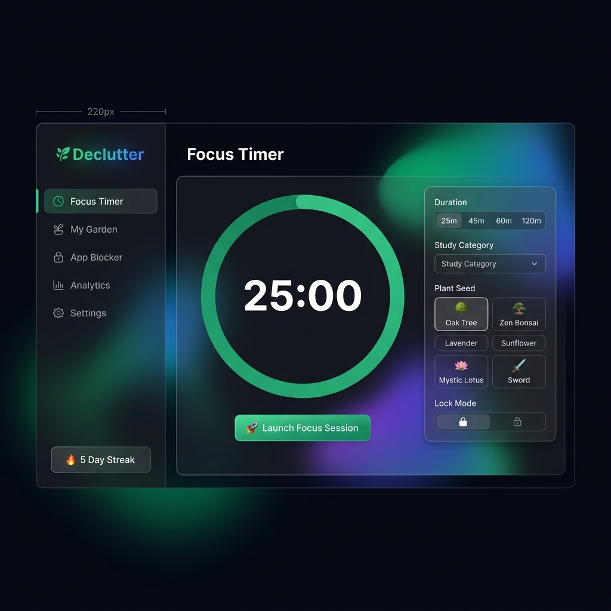
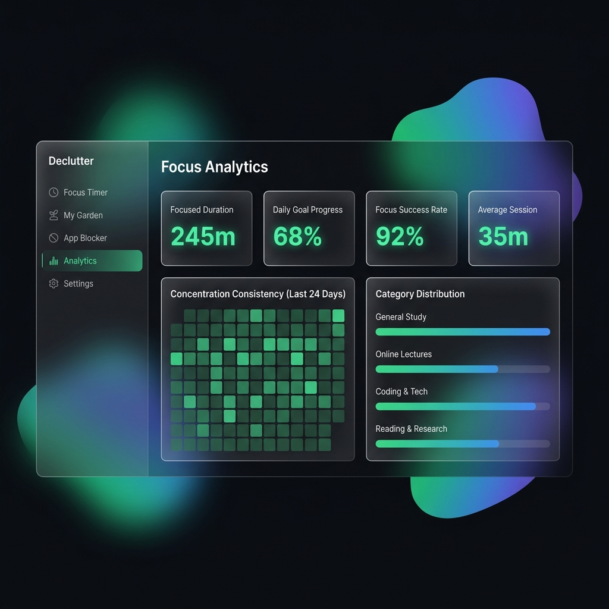
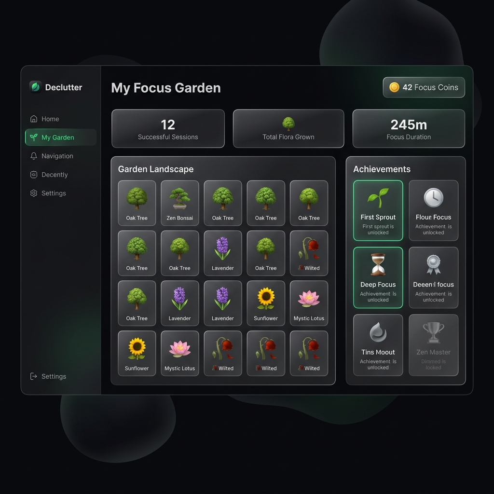

# Declutter

Declutter is a Windows-focused productivity app for deep work, study sessions, and strict distraction control. It combines a polished React/Tauri desktop interface with a Rust Windows service that can enforce lock modes beyond a normal focus timer.

Current release: **v0.1.0**

Download the Windows installer:
https://github.com/sunnydev07/Declutter-/releases/download/v0.1.0/Declutter_0.1.0_x64-setup.exe

> Note: The installer is currently unsigned. Windows SmartScreen may show a warning until the app is code signed and builds publisher reputation.

---

## Screenshots

<p align="center">
  
  <br/>
  <em>Focus Timer — Set your duration, choose a plant seed, and lock in.</em>
</p>

<p align="center">
  
  <br/>
  <em>Analytics Dashboard — Track focus hours, success rates, and study patterns.</em>
</p>

<p align="center">
  
  <br/>
  <em>Focus Garden — Grow a virtual garden from your deep concentration sessions.</em>
</p>

---

## What Declutter Does

- Runs as a native Windows desktop app built with Tauri 2, React 19, TypeScript, and Vite.
- Installs `DeclutterService`, a Rust Windows service used for lock enforcement and recovery.
- Supports multiple lock levels for different focus situations.
- Blocks distracting apps through process monitoring.
- Blocks distracting websites through hosts-file enforcement.
- Protects strict sessions with keyboard hook restrictions and optional full-screen overlay behavior.
- Tracks focus sessions, streaks, daily stats, and garden progress locally.
- Includes safety and recovery tooling for restoring Windows policies if a lock is interrupted.

---

## Lock Modes

- **Soft Lock**: A lighter focus timer for sessions where you only need self-accountability.
- **App Lock**: Blocks selected apps and websites while leaving normal keyboard and mouse input available.
- **View Lock**: Designed for lectures, reading, and video-based study. Adds keyboard restrictions while keeping mouse input usable.
- **Full Lock**: The strictest mode. Adds stronger input restrictions, process enforcement, website blocking, and overlay behavior.

Sword Mode is available for sessions where manual unlock should be blocked until the timer naturally expires.

---

## Installation

### Recommended: GitHub Release

Download:
https://github.com/sunnydev07/Declutter-/releases/tag/v0.1.0

Install:

1. Download `Declutter_0.1.0_x64-setup.exe`.
2. Run the installer on Windows 10 or Windows 11.
3. Approve the administrator prompt.
4. Launch Declutter from the Start Menu or desktop shortcut.

Admin permission is required because Declutter installs and starts the background Windows service named `DeclutterService`.

### Important Install Notes

- Windows x64 is required for the current installer.
- The app is not code signed yet, so SmartScreen may warn that the publisher is unknown.
- The installer registers `DeclutterService` during install and removes it during uninstall.
- For first-time testing, use a short manual session before trying a long strict lock.

---

## Safety And Recovery

Declutter can disable or restrict system behavior while a focus session is active. Use strict modes carefully.

Recovery protections include:

- Session state recovery under `ProgramData/Declutter`.
- Cleanup when a session ends normally.
- Service uninstall hooks that stop and delete `DeclutterService`.
- Emergency repair behavior in the app for restoring Windows policies.
- `public/failsafe/EmergencyUnlock.bat` for manual recovery support.

If you are testing a new build, start with a 1-minute session before using longer lock durations.

---

## Architecture

- **Frontend**: React 19, TypeScript, Vite
- **Desktop shell**: Tauri 2
- **Service**: Rust Windows service in `src-service`
- **Desktop commands**: Rust/Tauri commands in `src-tauri`
- **IPC**: Windows named pipe communication between app and service
- **Local data**: Frontend persistence through `src/utils/db.ts` and `localStorage`
- **Installer**: Tauri NSIS bundle with service install/uninstall hooks

Project layout:

```text
src/          React + TypeScript frontend
src-tauri/   Tauri desktop shell, app icons, installer config
src-service/ Rust Windows service for lock enforcement
screenshots/ README screenshots
```

---

## Build From Source

Prerequisites:

- Windows 10 or Windows 11
- Node.js 18+
- Rust stable MSVC toolchain
- Microsoft C++ Build Tools

Install dependencies:

```powershell
npm install
```

Run the Vite UI only:

```powershell
npm run dev
```

Build the frontend:

```powershell
npm run build
```

Check Rust crates:

```powershell
cargo check --workspace
```

Build the Windows installer:

```powershell
npm run build:exe
```

The generated installer will be created under:

```text
target/release/bundle/nsis/
```

Expected v0.1.0 output:

```text
target/release/bundle/nsis/Declutter_0.1.0_x64-setup.exe
```

---

## Release Notes: v0.1.0

- Added the final Windows x64 NSIS setup installer.
- Added installer hooks to register and remove `DeclutterService`.
- Updated app icon assets from the Declutter icon source.
- Added `npm run build:exe` to build the service sidecar and Tauri installer in one command.
- Added release-ready service sidecar bundling for Tauri.
- Added recovery-oriented service cleanup behavior for installer updates and uninstalls.

---

## Disclaimer

Declutter intentionally enforces focus by changing Windows behavior during active sessions. It can affect Task Manager, command shells, keyboard shortcuts, websites, running processes, and overlays depending on the lock mode.

Use it responsibly, test short sessions first, and do not use strict modes when you cannot afford interruption.

---

Built for focused work on Windows.
